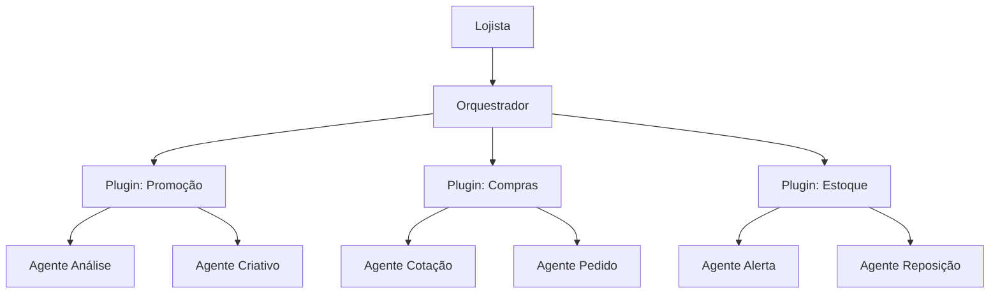

<div align="center">

# Gondola AI

**Framework de automação por IA para supermercados**

Orquestre agentes de IA especializados para automatizar os processos operacionais do seu supermercado — promoções, compras, gestão de estoque e mais.

[](https://claude.ai/code)
[](https://nodejs.org/)

</div>

---

## O que é a Gondola

A Gondola AI é um framework que transforma o Claude Code em um assistente operacional completo para supermercados. No centro do framework está o **Orquestrador** — um agente de IA que coordena equipes de agentes especializados para executar os processos do dia a dia da loja.

Cada processo operacional (promoções, compras, gestão de estoque) é um **plugin** independente que pode ser instalado a partir do marketplace oficial da Avanço Informática. Cada plugin traz consigo seus próprios agentes especializados, que trabalham em conjunto sob o comando do Orquestrador.

O lojista conversa diretamente com o Orquestrador em linguagem natural. O Orquestrador entende o pedido, aciona os agentes certos, acompanha a execução e entrega o resultado — sem que o lojista precise saber quais agentes existem ou como funcionam por baixo.

## Como funciona



Cada **plugin** é um processo completo e autossuficiente:
- Traz seus próprios agentes especializados
- Define seu fluxo de execução
- Gerencia suas configurações e dados
- Pode ser instalado e atualizado independentemente

## Instalação rápida

**Pré-requisitos:** [Node.js](https://nodejs.org/) 18+ e [Claude Code](https://claude.ai/code) instalados.

```bash
npx create-gondola
```

O instalador baixa o framework e configura o ambiente. Após a instalação, abra o Claude Code na pasta criada:

```bash
cd gondola-ai
claude
```

O Orquestrador vai recebê-lo e orientar os próximos passos.

## Conectando ao marketplace

Para instalar plugins de automação, você precisa se conectar ao marketplace oficial da Avanço Informática. Esse acesso é disponibilizado para clientes da Avanço.

**1. Registre o marketplace:**

```
/plugin marketplace add varejo-tech/gondola-marketplace
```

**2. Veja os plugins disponíveis:**

```
/plugin
```

**3. Instale o plugin desejado:**

```
/plugin install nome-do-plugin
```

Após instalar um plugin, o Orquestrador reconhece automaticamente o novo processo e está pronto para executá-lo.

## Atualizando a Gondola

Três formas de manter o framework atualizado:

| Método | Comando | Onde rodar |
|---|---|---|
| Dentro do Claude Code | `/gondola update` | No terminal do Claude Code |
| Via terminal | `npx create-gondola` | Na pasta da Gondola |
| Via git | `git pull` | Na pasta da Gondola (se clonou via git) |

As atualizações do framework nunca alteram suas configurações, memória ou plugins instalados.

Para atualizar plugins individualmente:

```
/plugin update nome-do-plugin
```

## Para desenvolvedores

Se você é desenvolvedor da Avanço Informática e quer contribuir com o framework ou criar novos plugins, consulte o repositório [gondola-dev-tools](https://github.com/varejo-tech/gondola-dev-tools) para instruções de setup do ambiente de desenvolvimento.

O setup rápido:

```bash
git clone https://github.com/varejo-tech/gondola-ai.git
cd gondola-ai
git clone https://github.com/varejo-tech/gondola-dev-tools.git .dev
./bootstrap.sh
.dev/modo.sh dev
```

## Suporte

A Gondola AI é desenvolvida e mantida pela **Avanço Informática**.

- Suporte técnico para clientes: entre em contato com seu consultor Avanço
- Problemas no framework: abra uma issue neste repositório
