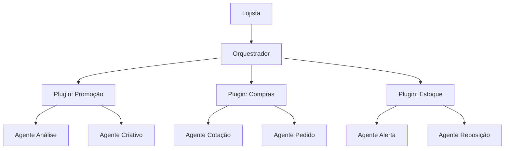

# Gondola AI — Distribution Implementation Plan

> **For agentic workers:** REQUIRED SUB-SKILL: Use superpowers:subagent-driven-development (recommended) or superpowers:executing-plans to implement this plan task-by-task. Steps use checkbox (`- [ ]`) syntax for tracking.

**Goal:** Enable distribution of the Gondola AI framework to supermarket operators (lojistas) via `npx create-gondola`, and to Avanço developers via separate private repos for dev-tools and marketplace.

**Architecture:** Four GitHub repos — `gondola-ai` (public framework), `create-gondola` (public npm installer), `gondola-marketplace` (private plugin catalog), `gondola-dev-tools` (private dev infrastructure). The installer downloads the framework, bootstrap creates local files, and the Orchestrator handles onboarding when no plugins are installed.

**Tech Stack:** Node.js (npm package), GitHub API (releases), Bash (bootstrap), Claude Code plugin system (marketplace/plugins)

**Spec:** `docs/superpowers/specs/2026-04-12-distribution-design.md`

---

### Task 1: Create `version.json`

**Files:**
- Create: `version.json`

The framework needs version tracking for `/gondola update` to work.

- [ ] **Step 1: Create version.json at root**

```json
{
  "version": "1.0.0",
  "name": "gondola-ai",
  "repository": "avanco/gondola-ai"
}
```

- [ ] **Step 2: Verify it's not in .gitignore**

Run: `grep version.json .gitignore`
Expected: No match (file should be tracked)

- [ ] **Step 3: Commit**

```bash
git add version.json
git commit -m "chore: add version.json for framework version tracking"
```

---

### Task 2: Update `bootstrap.sh` for distribution

**Files:**
- Modify: `bootstrap.sh`

The current `bootstrap.sh` creates `.dev/` infrastructure that should NOT exist in the lojista installation. It also embeds the full `CLAUDE.dev.md` content which belongs in `gondola-dev-tools`. The bootstrap must be split: it only creates what the lojista needs (local files, memory, settings symlinks for op mode).

- [ ] **Step 1: Read current bootstrap.sh**

Read `bootstrap.sh` to understand the full flow. Key sections to preserve for lojista:
- `.claude/` directory creation
- `memory.op.md` creation
- `.gitignore` creation
- `report-progress.sh` creation (already exists in repo, bootstrap should not overwrite)
- Settings for op mode

Key sections to REMOVE (these belong in `gondola-dev-tools`):
- `.dev/` directory creation (Passo 1 partial)
- `CLAUDE.dev.md` content (Passo 2)
- `modo.sh` creation (Passo 3)
- `settings.dev.json` creation (Passo 5 partial)
- `memory.dev.md` creation (Passo 4 partial)
- Mode activation to dev (Passo 6)

- [ ] **Step 2: Rewrite bootstrap.sh for lojista-only setup**

```bash
#!/bin/bash
# bootstrap.sh — Inicializa o framework Gondola AI para o lojista
# Executar uma única vez após instalar o framework.
# Uso: bash bootstrap.sh

set -e

echo "╔══════════════════════════════════════════════╗"
echo "║  Gondola AI — Avanço Informática              ║"
echo "║  Setup v1.0                                    ║"
echo "╚══════════════════════════���═══════════════════╝"
echo ""

# --- Validação ---
if [ -f ".claude/settings.json" ] && [ ! -L ".claude/settings.json" ]; then
  echo "⚠️  Framework já configurado. Pulando setup."
  exit 0
fi

# --- Passo 1: Estrutura de pastas ---
echo "→ Criando estrutura local..."

mkdir -p .claude

# --- Passo 2: CLAUDE.md aponta para Orquestrador ---
echo "→ Configurando persona do Orquestrador..."

# No modo lojista, CLAUDE.md é uma cópia direta (não symlink)
cp CLAUDE.orquestrador.md CLAUDE.md

# --- Passo 3: Memória local ---
echo "→ Criando memória local..."

touch memory.op.md

# --- Passo 4: Settings para modo operação ---
echo "→ Configurando permissões..."

cat > .claude/settings.json << 'SETTINGSEOF'
{
  "permissions": {
    "allow": [
      "Bash(*)", "Read(*)", "Write(*)", "WebFetch(*)"
    ],
    "deny": []
  },
  "hooks": {
    "PreToolUse": [{
      "matcher": ".*",
      "hooks": [{
        "type": "command",
        "command": "node .mission-control/server/send_event.js --event-type PreToolUse"
      }]
    }],
    "PostToolUse": [{
      "matcher": ".*",
      "hooks": [{
        "type": "command",
        "command": "node .mission-control/server/send_event.js --event-type PostToolUse"
      }]
    }],
    "Stop": [{
      "matcher": ".*",
      "hooks": [{
        "type": "command",
        "command": "node .mission-control/server/send_event.js --event-type Stop"
      }]
    }]
  }
}
SETTINGSEOF

# --- Passo 5: .gitignore para arquivos locais ---
echo "→ Configurando .gitignore..."

cat > .gitignore << 'GIEOF'
# Arquivos locais do lojista — não versionar
CLAUDE.md
memory.op.md
.claude/settings.json
.claude/settings.local.json
.claude/memory.md

# Infraestrutura de desenvolvimento (se existir)
.dev/

# Mission Control DB e runtime
.mission-control/db/
.mission-control/pid
.mission-control/port

# OS
.DS_Store
Thumbs.db
GIEOF

# --- Resultado ---
echo ""
echo "✅ Gondola AI configurada."
echo ""
echo "Próximo passo: abra o Claude Code nesta pasta."
echo "  cd $(pwd) && claude"
echo ""
echo "Para conectar ao marketplace de plugins da Avanço:"
echo "  /plugin marketplace add avanco/gondola-marketplace"
```

- [ ] **Step 3: Verify the script runs without errors**

Run: `bash -n bootstrap.sh`
Expected: No syntax errors

- [ ] **Step 4: Commit**

```bash
git add bootstrap.sh
git commit -m "refactor(bootstrap): adaptar para instalação do lojista

Remove criação de .dev/ e artefatos de desenvolvimento.
Bootstrap agora cria apenas o necessário para o modo operação."
```

---

### Task 3: Add onboarding section to `CLAUDE.orquestrador.md`

**Files:**
- Modify: `CLAUDE.orquestrador.md`

The Orchestrator needs to detect an empty gondola (no plugins) and display the welcome message.

- [ ] **Step 1: Add onboarding section after "Processos disponíveis"**

Insert after the `### Comando /processos` subsection (after line 46 of current file), before `## Modos de execução`:

```markdown
### Onboarding — Gondola vazia

Quando `/processos` retorna lista vazia (nenhum plugin de tipo "processo" instalado), você entra em modo de onboarding. Não tente operar processos inexistentes.

**Mensagem de boas-vindas** (exiba na primeira interação quando não há plugins):

> Bem-vindo à gondola.ai. Eu sou o Orquestrador da gondola e minha missão é ajudá-lo a executar seus processos de forma automatizada por agentes de IA especialistas. Por enquanto sua gondola está vazia — para começar a automatizar os seus processos é necessário conectar ao marketplace da Avanço e acessar o catálogo de plugins da gondola.ai. Se precisar de ajuda para executar estes passos, estou à disposição.

**Se o lojista pedir ajuda**, guie passo a passo:

1. **Registrar o marketplace**: peça ao lojista para digitar `/plugin marketplace add avanco/gondola-marketplace`. Explique que isso conecta ao catálogo oficial de plugins da Avanço. Se falhar por falta de acesso, oriente o lojista a entrar em contato com a Avanço para obter as credenciais.
2. **Visualizar plugins disponíveis**: peça para digitar `/plugin`. Isso abre a interface de plugins onde ele pode ver o que está disponível.
3. **Instalar um plugin**: oriente a usar `/plugin install nome-do-plugin` para instalar o plugin desejado.

**Após o primeiro plugin ser instalado**, retorne ao comportamento operacional normal — apresente os processos disponíveis e pergunte qual o lojista quer executar.
```

- [ ] **Step 2: Also update the reference to marketplace name**

In the existing "Processos disponíveis" section (line 41), replace the reference to `gondola-plugins-catalog` with `gondola-marketplace`:

Old: `Plugins oficiais da Avanço são instalados a partir do catálogo `gondola-plugins-catalog` via `/plugin marketplace add` + `/plugin install`.`

New: `Plugins oficiais da Avanço são instalados a partir do marketplace `gondola-marketplace` via `/plugin marketplace add avanco/gondola-marketplace` + `/plugin install`.`

- [ ] **Step 3: Commit**

```bash
git add CLAUDE.orquestrador.md
git commit -m "feat(orquestrador): adicionar onboarding para gondola vazia

Orquestrador detecta quando não há plugins instalados e exibe
mensagem de boas-vindas com orientações de registro do marketplace."
```

---

### Task 4: Create `/gondola update` slash command

**Files:**
- Create: `.claude/commands/gondola-update.md`

- [ ] **Step 1: Create the slash command file**

```markdown
---
description: Atualiza o framework Gondola AI para a versão mais recente
---

Você é o assistente de atualização do framework Gondola AI.

## O que fazer

1. Leia o arquivo `version.json` na raiz do projeto para obter a versão atual.

2. Consulte a versão mais recente disponível no GitHub:

```bash
curl -s https://api.github.com/repos/avanco/gondola-ai/releases/latest | node -e "
const chunks = [];
process.stdin.on('data', c => chunks.push(c));
process.stdin.on('end', () => {
  const data = JSON.parse(chunks.join(''));
  if (data.tag_name) {
    console.log(JSON.stringify({ version: data.tag_name.replace('v', ''), url: data.tarball_url }));
  } else {
    console.log(JSON.stringify({ error: 'Nenhum release encontrado' }));
  }
});
"
```

3. Compare as versões. Se a versão local é igual ou superior à remota, informe:
   > "Sua Gondola está atualizada (versão X.Y.Z)."

4. Se há atualização disponível, informe ao lojista qual é a versão nova e pergunte se deseja atualizar.

5. Se o lojista confirmar, baixe o tarball do release e extraia os arquivos atualizáveis:

```bash
# Baixar release
curl -L -o /tmp/gondola-update.tar.gz "<tarball_url>"

# Extrair em pasta temporária
mkdir -p /tmp/gondola-update
tar -xzf /tmp/gondola-update.tar.gz -C /tmp/gondola-update --strip-components=1

# Copiar arquivos do framework (nunca sobrescrever arquivos locais)
cp /tmp/gondola-update/CLAUDE.orquestrador.md ./CLAUDE.orquestrador.md
cp /tmp/gondola-update/report-progress.sh ./report-progress.sh
cp /tmp/gondola-update/start-process.sh ./start-process.sh
cp /tmp/gondola-update/version.json ./version.json
cp -r /tmp/gondola-update/.mission-control/ ./.mission-control/
cp -r /tmp/gondola-update/.claude/commands/ ./.claude/commands/

# Limpar
rm -rf /tmp/gondola-update /tmp/gondola-update.tar.gz
```

6. Após atualizar, reconfigure o CLAUDE.md local:

```bash
cp CLAUDE.orquestrador.md CLAUDE.md
```

7. Informe o lojista:
   > "Gondola atualizada de X.Y.Z para A.B.C. Reinicie o Claude Code para aplicar as mudanças."

## Arquivos que NUNCA devem ser sobrescritos

- `memory.op.md` (memória do lojista)
- `.claude/settings.json` (configuração local)
- `.claude/settings.local.json` (overrides locais)
- Qualquer arquivo dentro de `~/.claude/plugins/` (plugins instalados)
- `.dev/` (se existir — ambiente de dev)
```

- [ ] **Step 2: Verify the command file has valid frontmatter**

Run: `head -3 .claude/commands/gondola-update.md`
Expected: `---`, `description:`, `---`

- [ ] **Step 3: Commit**

```bash
git add .claude/commands/gondola-update.md
git commit -m "feat: adicionar comando /gondola update

Slash command que verifica e aplica atualizações do framework
via GitHub releases, preservando arquivos locais do lojista."
```

---

### Task 5: Write the README.md

**Files:**
- Create: `README.md`

This is the public-facing documentation. Must be well-formatted, accessible, and professional.

- [ ] **Step 1: Create README.md**

```markdown
<div align="center">

# 🛒 Gondola AI

**Framework de automação por IA para supermercados**

Orquestre agentes de IA especializados para automatizar os processos operacionais do seu supermercado — promoções, compras, gestão de estoque e mais.

[](https://claude.ai/code)
[](https://nodejs.org/)

</div>

---

## O que é a Gondola

A Gondola AI é um framework que transforma o Claude Code em um assistente operacional completo para supermercados. No centro do framework está o **Orquestrador** — um agente de IA que coordena equipes de agentes especializados para executar os processos do dia a dia da loja.

Cada processo operacional (promoções, compras, gestão de estoque) é um **plugin** independente que pode ser instalado a partir do marketplace oficial da Avanço Informática. Cada plugin traz consigo seus próprios agentes especializados, que trabalham em conjunto sob o comando do Orquestrador.

O lojista conversa diretamente com o Orquestrador em linguagem natural. O Orquestrador entende o pedido, aciona os agentes certos, acompanha a execução e entrega o resultado — sem que o lojista precise saber quais agentes existem ou como funcionam por baixo.

## Como funciona



Cada **plugin** é um processo completo e autossuficiente:
- Traz seus próprios agentes especializados
- Define seu fluxo de execução
- Gerencia suas configurações e dados
- Pode ser instalado e atualizado independentemente

## Instalação rápida

**Pré-requisitos:** [Node.js](https://nodejs.org/) 18+ e [Claude Code](https://claude.ai/code) instalados.

```bash
npx create-gondola
```

O instalador baixa o framework e configura o ambiente. Após a instalação, abra o Claude Code na pasta criada:

```bash
cd gondola-ai
claude
```

O Orquestrador vai recebê-lo e orientar os próximos passos.

## Conectando ao marketplace

Para instalar plugins de automação, você precisa se conectar ao marketplace oficial da Avanço Informática. Esse acesso é disponibilizado para clientes da Avanço.

**1. Registre o marketplace:**

```
/plugin marketplace add avanco/gondola-marketplace
```

**2. Veja os plugins disponíveis:**

```
/plugin
```

**3. Instale o plugin desejado:**

```
/plugin install nome-do-plugin
```

Após instalar um plugin, o Orquestrador reconhece automaticamente o novo processo e está pronto para executá-lo.

## Atualizando a Gondola

Três formas de manter o framework atualizado:

| Método | Comando | Onde rodar |
|---|---|---|
| Dentro do Claude Code | `/gondola update` | No terminal do Claude Code |
| Via terminal | `npx create-gondola` | Na pasta da Gondola |
| Via git | `git pull` | Na pasta da Gondola (se clonou via git) |

As atualizações do framework nunca alteram suas configurações, memória ou plugins instalados.

Para atualizar plugins individualmente:

```
/plugin update nome-do-plugin
```

## Para desenvolvedores

Se você é desenvolvedor da Avanço Informática e quer contribuir com o framework ou criar novos plugins, consulte o repositório [gondola-dev-tools](https://github.com/avanco/gondola-dev-tools) para instruções de setup do ambiente de desenvolvimento.

O setup rápido:

```bash
git clone https://github.com/avanco/gondola-ai.git
cd gondola-ai
git clone https://github.com/avanco/gondola-dev-tools.git .dev
./bootstrap.sh
.dev/modo.sh dev
```

## Suporte

A Gondola AI é desenvolvida e mantida pela **Avanço Informática**.

- Suporte técnico para clientes: entre em contato com seu consultor Avanço
- Problemas no framework: abra uma issue neste repositório
```

- [ ] **Step 2: Review the file renders correctly**

Run: `head -20 README.md`
Expected: See the header and badges section

- [ ] **Step 3: Commit**

```bash
git add README.md
git commit -m "docs: adicionar README.md com guia de instalação e arquitetura

Documentação pública cobrindo instalação via npx, conexão ao marketplace,
atualização do framework e orientações para desenvolvedores."
```

---

### Task 6: Create `create-gondola` npm package

**Files:**
- Create: `../create-gondola/package.json`
- Create: `../create-gondola/index.js`
- Create: `../create-gondola/README.md`

This is a separate repo. Create it alongside `gondola-ai`.

- [ ] **Step 1: Create directory and initialize**

```bash
mkdir -p ../create-gondola
cd ../create-gondola
git init
```

- [ ] **Step 2: Create package.json**

```json
{
  "name": "create-gondola",
  "version": "1.0.0",
  "description": "Instalador do framework Gondola AI para supermercados",
  "main": "index.js",
  "bin": {
    "create-gondola": "./index.js"
  },
  "keywords": [
    "gondola",
    "ai",
    "supermarket",
    "automation",
    "claude-code"
  ],
  "author": "Avanço Informática",
  "license": "MIT",
  "engines": {
    "node": ">=18.0.0"
  }
}
```

- [ ] **Step 3: Create index.js**

```javascript
#!/usr/bin/env node

const https = require("https");
const fs = require("fs");
const path = require("path");
const { execSync } = require("child_process");
const readline = require("readline");

const REPO_OWNER = "avanco";
const REPO_NAME = "gondola-ai";
const DEFAULT_DIR = "gondola-ai";

// Files/dirs to exclude from lojista installation
const EXCLUDE = new Set([".git", ".dev", ".github", ".worktrees"]);

function ask(question) {
  const rl = readline.createInterface({
    input: process.stdin,
    output: process.stdout,
  });
  return new Promise((resolve) => {
    rl.question(question, (answer) => {
      rl.close();
      resolve(answer.trim());
    });
  });
}

function httpsGet(url, options = {}) {
  return new Promise((resolve, reject) => {
    const opts = {
      ...require("url").parse(url),
      headers: { "User-Agent": "create-gondola" },
      ...options,
    };
    https.get(opts, (res) => {
      if (res.statusCode >= 300 && res.statusCode < 400 && res.headers.location) {
        return httpsGet(res.headers.location, options).then(resolve).catch(reject);
      }
      if (res.statusCode !== 200) {
        return reject(new Error(`HTTP ${res.statusCode} for ${url}`));
      }
      const chunks = [];
      res.on("data", (c) => chunks.push(c));
      res.on("end", () => resolve(Buffer.concat(chunks)));
      res.on("error", reject);
    }).on("error", reject);
  });
}

async function getLatestRelease() {
  const data = await httpsGet(
    `https://api.github.com/repos/${REPO_OWNER}/${REPO_NAME}/releases/latest`
  );
  return JSON.parse(data.toString());
}

async function downloadAndExtract(url, targetDir) {
  const tarball = path.join(targetDir, ".gondola-download.tar.gz");
  const data = await httpsGet(url);
  fs.writeFileSync(tarball, data);

  const tmpDir = path.join(targetDir, ".gondola-tmp");
  fs.mkdirSync(tmpDir, { recursive: true });

  execSync(`tar -xzf "${tarball}" -C "${tmpDir}" --strip-components=1`, {
    stdio: "ignore",
  });

  // Copy files excluding dev artifacts
  const entries = fs.readdirSync(tmpDir);
  for (const entry of entries) {
    if (EXCLUDE.has(entry)) continue;
    const src = path.join(tmpDir, entry);
    const dest = path.join(targetDir, entry);
    execSync(`cp -r "${src}" "${dest}"`, { stdio: "ignore" });
  }

  // Cleanup
  fs.unlinkSync(tarball);
  fs.rmSync(tmpDir, { recursive: true });
}

function isExistingInstallation(dir) {
  return fs.existsSync(path.join(dir, "version.json"));
}

function runBootstrap(dir) {
  const bootstrapPath = path.join(dir, "bootstrap.sh");
  if (fs.existsSync(bootstrapPath)) {
    execSync(`bash "${bootstrapPath}"`, { cwd: dir, stdio: "inherit" });
    fs.unlinkSync(bootstrapPath);
  }
}

async function main() {
  console.log("");
  console.log("  Gondola AI — Instalador");
  console.log("  Avanço Informática");
  console.log("");

  const dirName = (await ask(`Nome da pasta (${DEFAULT_DIR}): `)) || DEFAULT_DIR;
  const targetDir = path.resolve(dirName);
  const isUpdate = isExistingInstallation(targetDir);

  if (isUpdate) {
    console.log(`\n→ Atualização detectada em ${targetDir}`);
  }

  console.log("→ Buscando versão mais recente...");

  let release;
  try {
    release = await getLatestRelease();
  } catch (err) {
    console.error("✗ Não foi possível consultar o GitHub:", err.message);
    process.exit(1);
  }

  const version = release.tag_name.replace("v", "");
  console.log(`→ Versão: ${version}`);

  if (isUpdate) {
    const current = JSON.parse(
      fs.readFileSync(path.join(targetDir, "version.json"), "utf-8")
    );
    if (current.version === version) {
      console.log(`\n✓ Já está na versão mais recente (${version}).`);
      process.exit(0);
    }
    console.log(`→ Atualizando de ${current.version} para ${version}...`);
  } else {
    console.log("→ Baixando framework...");
    fs.mkdirSync(targetDir, { recursive: true });
  }

  try {
    await downloadAndExtract(release.tarball_url, targetDir);
  } catch (err) {
    console.error("✗ Erro ao baixar:", err.message);
    process.exit(1);
  }

  if (!isUpdate) {
    console.log("→ Configurando ambiente...");
    runBootstrap(targetDir);
  }

  console.log("");
  console.log("✓ Gondola AI instalada com sucesso!");
  console.log("");
  console.log("  Próximos passos:");
  console.log(`  1. cd ${dirName}`);
  console.log("  2. claude");
  console.log("");
  console.log("  O Orquestrador vai guiá-lo na conexão ao marketplace");
  console.log("  e instalação dos plugins de automação.");
  console.log("");
}

main().catch((err) => {
  console.error("Erro:", err.message);
  process.exit(1);
});
```

- [ ] **Step 4: Create README.md for the npm package**

```markdown
# create-gondola

Instalador do framework **Gondola AI** — automação por IA para supermercados.

## Uso

```bash
npx create-gondola
```

O instalador baixa o framework Gondola AI, configura o ambiente e prepara tudo para você começar a usar.

## Pré-requisitos

- [Node.js](https://nodejs.org/) 18+
- [Claude Code](https://claude.ai/code)

## O que é a Gondola AI

A Gondola AI é um framework que transforma o Claude Code em um assistente operacional para supermercados. Mais informações em [gondola-ai](https://github.com/avanco/gondola-ai).

## Licença

MIT — Avanço Informática
```

- [ ] **Step 5: Verify package.json is valid**

```bash
cd ../create-gondola && node -e "JSON.parse(require('fs').readFileSync('package.json','utf8')); console.log('OK')"
```

Expected: `OK`

- [ ] **Step 6: Verify index.js has no syntax errors**

```bash
node -c index.js
```

Expected: No errors

- [ ] **Step 7: Commit**

```bash
git add package.json index.js README.md
git commit -m "feat: create-gondola npm installer

Pacote npx que baixa o framework Gondola AI via GitHub releases,
executa bootstrap e prepara o ambiente para o lojista."
```

---

### Task 7: Create `gondola-marketplace` repo structure

**Files:**
- Create: `../gondola-marketplace/.claude-plugin/marketplace.json`
- Create: `../gondola-marketplace/README.md`

This is a new private repo. The `promocao` plugin will be copied here from the existing local catalog in a separate step (not part of this plan — that's a manual dev workflow).

- [ ] **Step 1: Create directory and initialize**

```bash
mkdir -p ../gondola-marketplace/.claude-plugin
cd ../gondola-marketplace
git init
```

- [ ] **Step 2: Create marketplace.json**

```json
{
  "name": "gondola-marketplace",
  "owner": {
    "name": "Avanço Informática"
  },
  "description": "Catálogo oficial de plugins Gondola AI — automação por IA para supermercados",
  "plugins": []
}
```

The `plugins` array starts empty. Plugins are added as they are published (copied from the dev catalog and added to this manifest).

- [ ] **Step 3: Create README.md**

```markdown
# Gondola Marketplace

Catálogo oficial de plugins para o framework **Gondola AI** da Avanço Informática.

## Para lojistas

Este marketplace é acessível apenas para clientes da Avanço Informática. Para conectar:

```
/plugin marketplace add avanco/gondola-marketplace
```

Para instalar um plugin:

```
/plugin install nome-do-plugin
```

Para atualizar plugins instalados:

```
/plugin update nome-do-plugin
```

## Para desenvolvedores

Consulte o repositório [gondola-dev-tools](https://github.com/avanco/gondola-dev-tools) para instruções de como desenvolver e publicar plugins neste marketplace.

## Plugins disponíveis

| Plugin | Descrição | Versão |
|---|---|---|
| *(nenhum publicado ainda)* | | |
```

- [ ] **Step 4: Commit**

```bash
git add .claude-plugin/marketplace.json README.md
git commit -m "feat: inicializar marketplace gondola

Estrutura base do catálogo oficial de plugins da Avanço Informática."
```

---

### Task 8: Create `gondola-dev-tools` repo structure

**Files:**
- Create: `../gondola-dev-tools/` (extracted from current `.dev/`)

Extract the `.dev/` contents into a standalone repo that devs clone into `.dev/`.

- [ ] **Step 1: Create directory and initialize**

```bash
mkdir -p ../gondola-dev-tools
cd ../gondola-dev-tools
git init
```

- [ ] **Step 2: Copy current .dev/ contents**

```bash
cp ../gondola-ai/.dev/CLAUDE.dev.md ../gondola-dev-tools/CLAUDE.dev.md
cp ../gondola-ai/.dev/modo.sh ../gondola-dev-tools/modo.sh
cp ../gondola-ai/.dev/settings.dev.json ../gondola-dev-tools/settings.dev.json
cp ../gondola-ai/.dev/settings.op.json ../gondola-dev-tools/settings.op.json
cp ../gondola-ai/.dev/memory.dev.md ../gondola-dev-tools/memory.dev.md
cp -r ../gondola-ai/.dev/templates ../gondola-dev-tools/templates
```

- [ ] **Step 3: Create README.md for dev-tools**

```markdown
# Gondola Dev Tools

Ferramentas de desenvolvimento para o framework **Gondola AI** — uso exclusivo da equipe Avanço Informática.

## Setup

Clone este repositório dentro da pasta `.dev/` do framework:

```bash
git clone https://github.com/avanco/gondola-ai.git
cd gondola-ai
git clone https://github.com/avanco/gondola-dev-tools.git .dev
./bootstrap.sh
.dev/modo.sh dev
```

## O que contém

| Arquivo | Função |
|---|---|
| `CLAUDE.dev.md` | Persona do Agente Desenvolvedor do framework |
| `modo.sh` | Script de alternância entre modo dev e operação |
| `settings.dev.json` | Permissões e config para modo desenvolvimento |
| `settings.op.json` | Permissões, hooks e config para modo operação |
| `memory.dev.md` | Memória de sessão de desenvolvimento |
| `templates/` | Referência canônica do contrato de plugin |

## Modos

```bash
.dev/modo.sh dev      # Ativa modo desenvolvedor (persona dev)
.dev/modo.sh op       # Ativa modo operação (persona Orquestrador)
.dev/modo.sh status   # Mostra modo ativo
```

No Claude Code, use `/modo` para alternar.

## Templates de plugin

A pasta `templates/` contém a documentação canônica do contrato de plugin:

- `criar-processo.md` — Como criar um plugin de processo
- `criar-agente.md` — Como criar subagentes
- `criar-skill.md` — Como criar skills
- `convencoes-framework.md` — Convenções de nomenclatura e estrutura
```

- [ ] **Step 4: Commit**

```bash
git add .
git commit -m "feat: inicializar gondola-dev-tools

Ferramentas de desenvolvimento extraídas do framework central.
Clonado como .dev/ dentro do gondola-ai pelos devs da Avanço."
```

---

### Task 9: Update `.gitignore` and clean up framework repo

**Files:**
- Modify: `.gitignore`

Ensure the `gondola-ai` repo only tracks files that should be distributed publicly.

- [ ] **Step 1: Read current .gitignore**

```bash
cat .gitignore
```

- [ ] **Step 2: Update .gitignore for distribution**

The `.gitignore` should exclude:
- `.dev/` (dev tools, cloned separately)
- `CLAUDE.md` (generated by bootstrap, local to each install)
- `memory.op.md` (local state)
- `.claude/settings.json` (local config, generated by bootstrap)
- `.claude/settings.local.json` (local overrides)
- `.claude/memory.md` (local symlink)
- `.mission-control/db/` (runtime data)
- `.mission-control/pid` (runtime)
- `.mission-control/port` (runtime)
- OS files

Files that SHOULD be tracked (committed to the public repo):
- `CLAUDE.orquestrador.md`
- `bootstrap.sh`
- `report-progress.sh`
- `start-process.sh`
- `version.json`
- `README.md`
- `.claude/commands/*.md`
- `.mission-control/server/` (server code)
- `.mission-control/dashboard/` (dashboard HTML)
- `.mission-control/start.sh`
- `docs/`

```
# Arquivos locais — gerados pelo bootstrap, não versionar
CLAUDE.md
memory.op.md
.claude/settings.json
.claude/settings.local.json
.claude/memory.md

# Infraestrutura de desenvolvimento (clonada separadamente)
.dev/

# Mission Control runtime
.mission-control/db/
.mission-control/pid
.mission-control/port

# Outputs de processos
**/outputs/

# OS
.DS_Store
Thumbs.db

# Node
node_modules/
```

- [ ] **Step 3: Commit**

```bash
git add .gitignore
git commit -m "chore: atualizar .gitignore para distribuição pública

Garante que apenas arquivos do framework são rastreados,
excluindo artefatos locais e de desenvolvimento."
```

---

### Task 10: Verify end-to-end flow

**Files:** None (verification only)

- [ ] **Step 1: Verify framework repo structure**

```bash
cd /path/to/gondola-ai
ls -la version.json README.md CLAUDE.orquestrador.md bootstrap.sh
ls -la .claude/commands/gondola-update.md
```

Expected: All files exist

- [ ] **Step 2: Verify bootstrap runs cleanly in a temp dir**

```bash
mkdir -p /tmp/test-gondola
cp -r /path/to/gondola-ai/* /tmp/test-gondola/
cp /path/to/gondola-ai/.gitignore /tmp/test-gondola/
cd /tmp/test-gondola
bash bootstrap.sh
```

Expected: Bootstrap completes, creates `CLAUDE.md`, `memory.op.md`, `.claude/settings.json`

- [ ] **Step 3: Verify onboarding text exists in Orquestrador**

```bash
grep "Bem-vindo à gondola.ai" CLAUDE.orquestrador.md
```

Expected: Match found

- [ ] **Step 4: Verify create-gondola package**

```bash
cd /path/to/create-gondola
node -c index.js && echo "Syntax OK"
```

Expected: `Syntax OK`

- [ ] **Step 5: Verify marketplace structure**

```bash
cd /path/to/gondola-marketplace
cat .claude-plugin/marketplace.json | node -e "JSON.parse(require('fs').readFileSync('/dev/stdin','utf8')); console.log('Valid JSON')"
```

Expected: `Valid JSON`

- [ ] **Step 6: Verify dev-tools structure**

```bash
cd /path/to/gondola-dev-tools
ls CLAUDE.dev.md modo.sh settings.dev.json settings.op.json templates/
```

Expected: All files present

- [ ] **Step 7: Clean up test directory**

```bash
rm -rf /tmp/test-gondola
```
